# 🐞 Error Report

## 🆔 ID
ERR-SIM-001


---

## 🧾 Título
Fallo de licencia en simulador Questa (Quartus)

---

## 📝 Descripción
Al intentar ejecutar la simulación desde Quartus con el simulador Questa, aparece una ventana de error indicando que no es posible verificar la licencia del software.

---

## 📄 Log del Error

```text
FEATURE START
This is license file for Questasim*-Intel FPGA Starter Edition
Number of seat licenses is 1
License Expires 05-Feb-2027
300 Your license version is outside the range of the contract.

FEATURE END
```

---

## 🧠 Causa del Error
- [x] Confirmada  

**Detalle:**  
Bug conocido en las versiones de Quartus descargadas durante febrero.  
El archivo de licencia de Questa no contiene la llave encriptada válida y retorna el código **300**, indicando un error del servidor de licencias.

---

## 🛠 Solución del Error


---

## ⚠️ Descripción del Problema

Si instaló Quartus recientemente y al intentar usar alguna herramienta de simulación le aparece un **error de licencia**, esta guía le explicará paso a paso cómo solucionarlo.

El simulador **Questa\*-FPGA Starter Edition** requiere una licencia gratuita de Intel que debe registrarse manualmente. El proceso toma aproximadamente **15-30 minutos**.

> 📝 **Nota:** La licencia es completamente **gratuita**. Solo necesita una cuenta de Intel y su correo institucional (o personal).

---

## 🔧 Paso 1: Acceder a License Setup en Quartus

1. Abra **Quartus Prime**

2. En la barra de menú superior, haga clic en **Tools**

3. En el menú desplegable, seleccione **License Setup**

   > *Imagen: Menú Tools con la opción License Setup resaltada*

   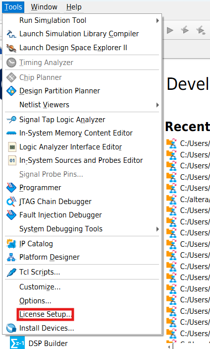

4. Se abrirá la ventana **License Setup**. Haga clic en el botón **"Download License"**

   > *Imagen: Ventana de License Setup con el botón Download License*

   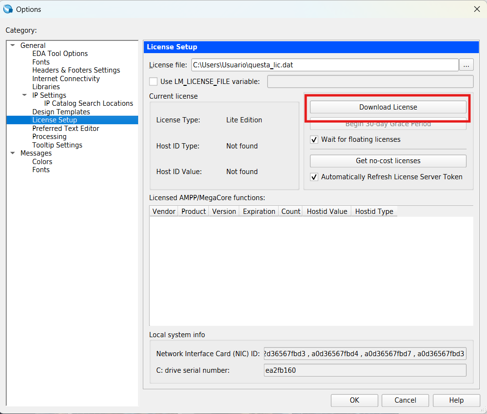

---

## 👤 Paso 2: Crear Cuenta en Intel

5. Se abrirá una **página web** en su navegador. Como aún no tiene cuenta, haga clic en el botón **"Enroll"**

   > *Imagen: Página de inicio de sesión de Intel con el botón Enroll visible*

   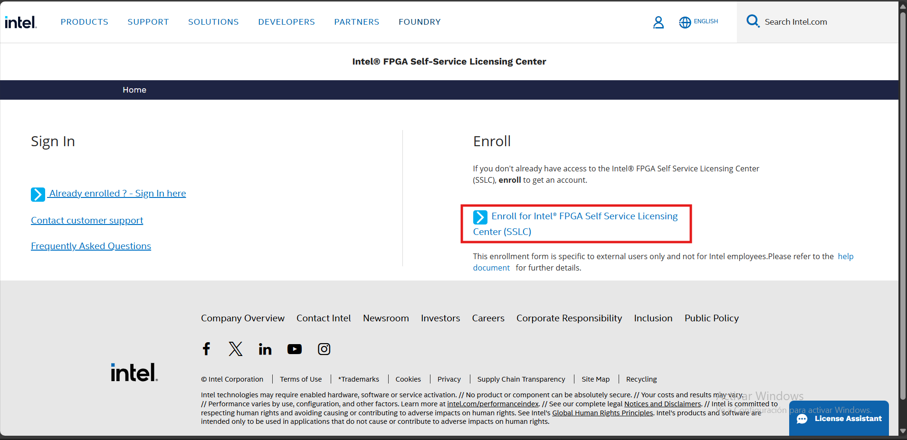

6. Rellene el **formulario de registro** con su correo institucional

   > ⚠️ **Recomendación:** Use su correo institucional (`@estudiantesunibague.edu.co`). Puede usar uno personal, pero se recomienda mantener las cuentas académicas separadas.

   > *Imagen: Formulario de registro con los campos de nombre y correo*

   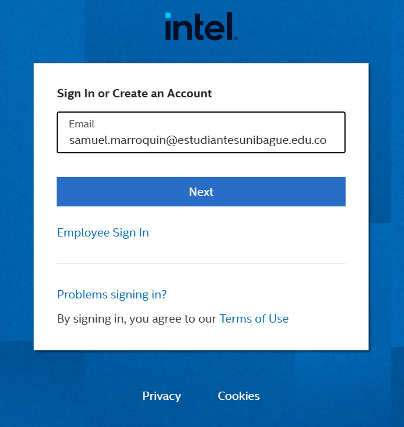

7. Una vez completado el formulario, le pedirán **verificar su correo** con un código. Ingréselo y haga clic en **"Create an account"**

8. Seleccione la opción **Estudiante** y haga clic en **"Next"** y luego **"Submit"**

   > *Imagen: Selección de tipo de usuario - opción Estudiante seleccionada*

   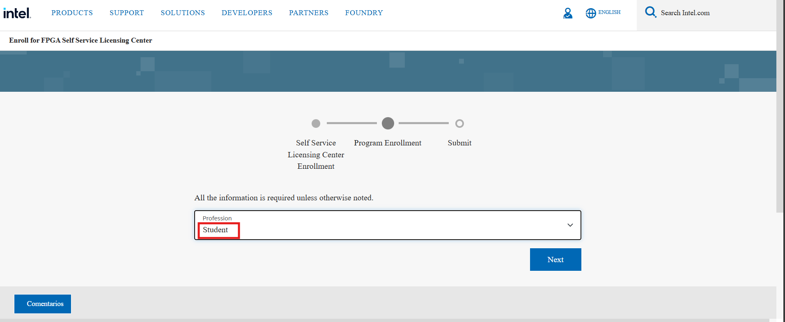

9. Espere el correo de confirmación de su cuenta antes de continuar

   > *Imagen: Pantalla de espera o correo de confirmación recibido*

   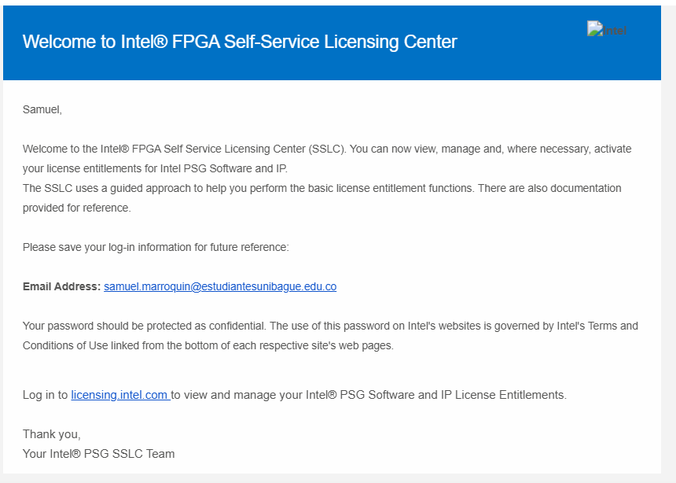

---

## 🌐 Paso 3: Ingresar al Portal de Licencias

10. Diríjase al siguiente enlace para iniciar sesión en el portal de licencias de Intel:

    ```
    https://licensing.intel.com/psg/s/?language=en_US
    ```

    > *Imagen: Portal de licencias de Intel*

    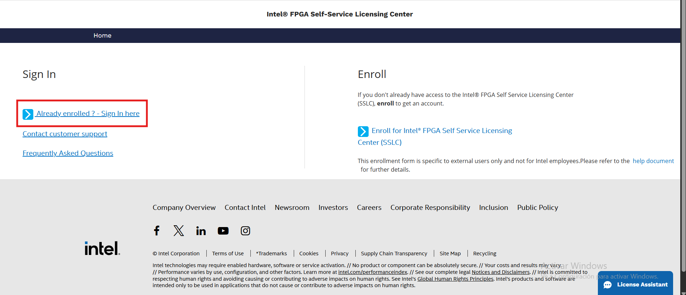

11. Inicie sesión con el correo que registró

    > 🔐 **Autenticación de dos factores:** Intel puede solicitar una forma adicional de verificación. Puede usar **Microsoft Authenticator** o recibir un **código por SMS**. Elija la que prefiera.

12. Una vez superada la autenticación, acepte los **términos de uso** cuando se le solicite

---

## 📋 Paso 4: Solicitar la Licencia Gratuita

13. En el portal, seleccione la opción **"Sign up for Evaluation or Non-Cost Licenses"**

    > *Imagen: Portal de licencias con la opción Sign up for Evaluation or Non-Cost Licenses*

    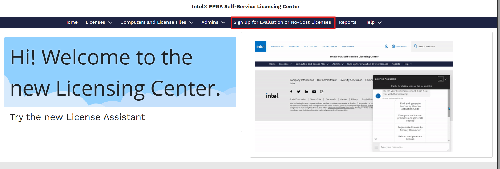

14. En la lista de licencias disponibles, seleccione:

    **✅ Questa\*-FPGA Starter Edition (License: SW-QUESTA)**

    Desplácese hacia abajo y haga clic en **"Next"**

    > *Imagen: Lista de licencias con Questa FPGA Starter Edition seleccionada*

    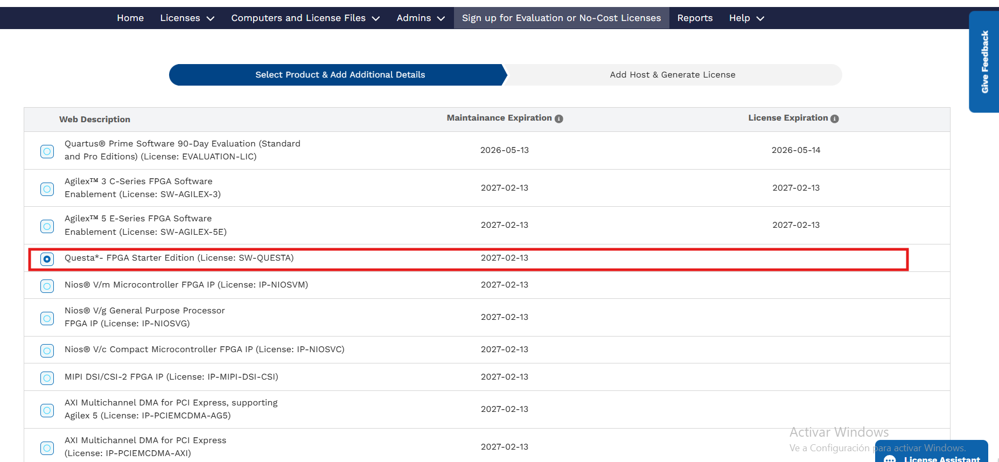

---

## 💻 Paso 5: Obtener el HOST ID del Computador

15. Haga clic en el botón **"+New Computer"** para registrar su equipo

    > *Imagen: Formulario de registro de computador con el botón +New Computer*

    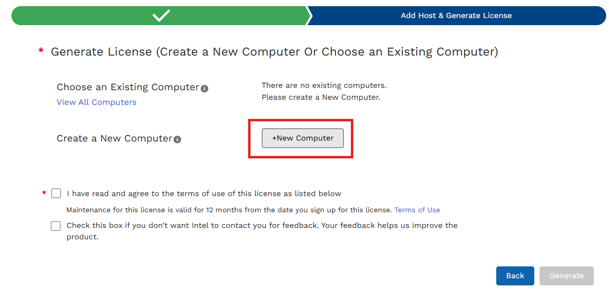

16. Para completar el formulario necesita el **HOST ID** de su computador. Siga estos pasos:

    a. Presione la tecla **Windows**, escriba **powershell** y ábralo

       > *Imagen: Búsqueda de PowerShell en el menú inicio de Windows*

       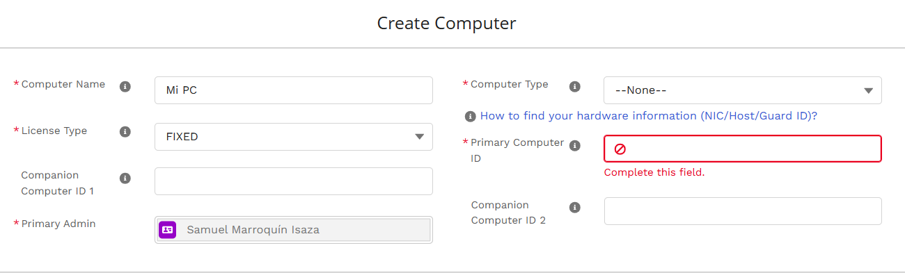

    b. En la terminal de PowerShell, escriba el siguiente comando y presione **Enter**:

       ```
       lmutil lmhostid
       ```

       > *Imagen: Terminal PowerShell con el comando lmutil lmhostid y el resultado (HOST ID)*

       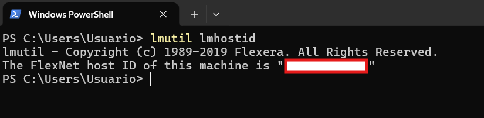

    c. Copie el **HOST ID** que aparece en pantalla

    d. Péguelo en el campo **"Primary Computer ID"** del formulario

---

## 📝 Paso 6: Completar el Registro y Descargar la Licencia

17. En el campo **"Computer Type"**, seleccione **NIC ID**

    > *Imagen: Formulario con NIC ID seleccionado en Computer Type*

    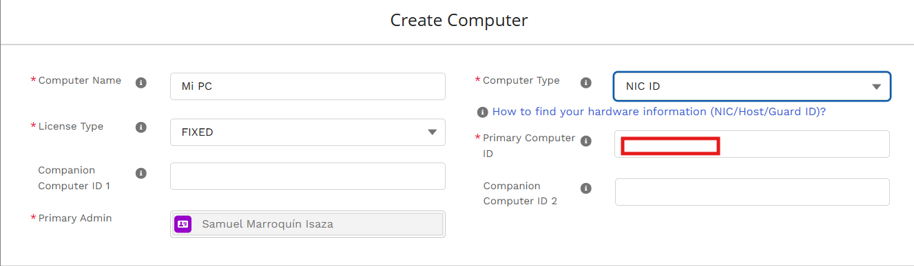

18. Acepte los **términos de uso** del formulario

    > *Imagen: Casilla de términos de uso marcada*

    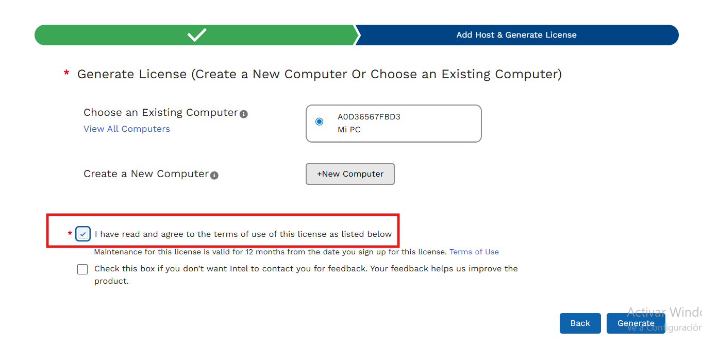

19. Haga clic en **"Generate"** o **"Submit"**. El archivo de licencia será enviado a su **correo registrado**

20. Descargue el archivo `.dat` de la licencia y **guárdelo en la siguiente ruta**:

    ```
    C:\Users\<nombre_de_usuario>\
    ```

    **Ejemplo:**
    ```
    C:\Users\usuario\
    ```

    > ⚠️ **Importante:** No guarde el archivo en carpetas con espacios o caracteres especiales en el nombre.

---

## ⚙️ Paso 7: Configurar la Variable de Entorno

21. Presione **Windows + R**, escriba `cmd` y presione **Enter** para abrir el símbolo del sistema

22. En la terminal, escriba el siguiente comando reemplazando `<ruta_al_archivo>` con la ruta donde guardó la licencia:

    ```
    setx SALT_LICENSE_SERVER <ruta_al_archivo>;%SALT_LICENSE_SERVER%
    ```

    **Ejemplo:**
    ```
    setx SALT_LICENSE_SERVER C:\Users\usuario\licencia.dat;%SALT_LICENSE_SERVER%
    ```

    > *Imagen: Terminal CMD con el comando setx ejecutado correctamente*

    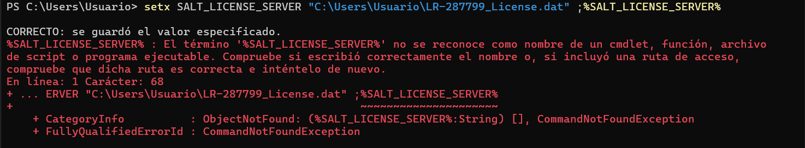

23. Cierre la terminal y **reinicie Quartus Prime** para que los cambios tengan efecto

---

## 📚 Recursos Adicionales

### Material del Curso

- **Repositorio GitHub:** [https://github.com/Samuel-M-I/Digitales_I](https://github.com/Samuel-M-I/Digitales_I)
- **Portal de Licencias Intel:** [https://licensing.intel.com/psg/s/?language=en_US](https://licensing.intel.com/psg/s/?language=en_US)

---

## 📅 Control de Versiones

| Versión | Fecha | Cambios |
|---------|-------|---------|
| 1.0 | Feb 2026 | Versión inicial - Solución licencia Questa |

---

**Preparado por:** Monitor de Electrónica Digital I
**Actualizado:** Febrero 2026
**Software:** Intel Quartus Prime Lite Edition 25.1 + Questa FPGA Starter Edition

---

## 🎯 Checklist de Configuración de Licencia

Use esta lista para verificar que completó todos los pasos:

- [ ] Abrí License Setup desde el menú Tools en Quartus
- [ ] Creé una cuenta en el portal de Intel (con correo institucional)
- [ ] Verifiqué mi correo y completé el registro como estudiante
- [ ] Inicié sesión en `licensing.intel.com` y acepté los términos
- [ ] Seleccioné "Questa\*-FPGA Starter Edition (SW-QUESTA)"
- [ ] Obtuve mi HOST ID con el comando `lmutil lmhostid` en PowerShell
- [ ] Registré mi computador con NIC ID y el HOST ID correcto
- [ ] Descargué el archivo `.dat` de la licencia al correo
- [ ] Guardé el archivo en `C:\Users\<usuario>\`
- [ ] Ejecuté el comando `setx` en CMD correctamente
- [ ] Reinicié Quartus y verifiqué que el simulador funciona

**¡Listo! El simulador Questa debería funcionar correctamente.**

---

## 📝 Notas (opcional)
- El problema es externo al diseño y al entorno local.
- No se soluciona reinstalando Quartus.
- Referencia: [foros oficiales](https://community.altera.com/discussions/fpga-device/300-your-license-version-is-outside-the-range-of-the-contract/350321) de Altera / Intel FPGA.

---

## 📌 Estado
- [x] Identificado  
- [x] Solucionado (workaround)  
- [x] Verificado  
- [x] Cerrado  
