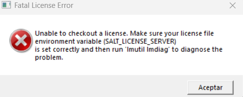

# 🐞 Error Report

## 🆔 ID
ERR-SIM-001


---

## 🧾 Título
Fallo de licencia en simulador Questa (Quartus)

---

## 📝 Descripción
Al intentar ejecutar la simulación desde Quartus con el simulador Questa, aparece una ventana de error indicando que no es posible verificar la licencia del software.

---

## 📄 Log del Error

```text
FEATURE START
This is license file for Questasim*-Intel FPGA Starter Edition
Number of seat licenses is 1
License Expires 05-Feb-2027
300 Your license version is outside the range of the contract.

FEATURE END
```

---

## 🧠 Causa del Error
- [x] Confirmada  

**Detalle:**  
Bug conocido en las versiones de Quartus descargadas durante febrero.  
El archivo de licencia de Questa no contiene la llave encriptada válida y retorna el código **300**, indicando un error del servidor de licencias.

---

## 🛠 Solución del Error
No existe solución oficial al momento.

**Acción recomendada:**
- Usar **ModelSim** como simulador alternativo, ya que no requiere licencia y permite realizar las simulaciones necesarias.

---

## 📝 Notas (opcional)
- El problema es externo al diseño y al entorno local.
- No se soluciona reinstalando Quartus.
- Referencia: [foros oficiales](https://community.altera.com/discussions/fpga-device/300-your-license-version-is-outside-the-range-of-the-contract/350321) de Altera / Intel FPGA.
- Se recomienda seguir la guía de [instalación de ModelSim](../../Guias/guia_instalacion_ModelSim.md).

---

## 📌 Estado
- [x] Identificado  
- [x] Solucionado (workaround)  
- [ ] Verificado  
- [ ] Cerrado  
