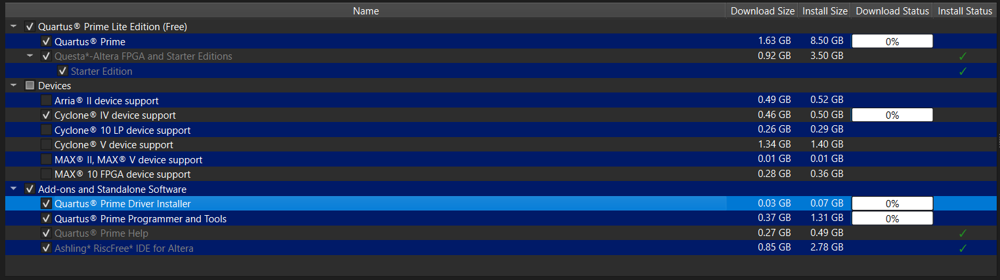
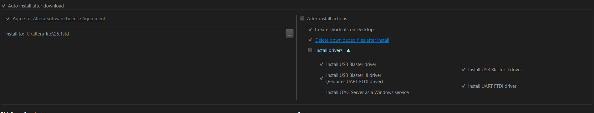

# Guía de Instalación - Intel Quartus Prime Lite 25.1
## Electrónica Digital I

---

## 📋 Tabla de Contenidos

1. Requisitos del Sistema
2. Descarga del Software
3. Instalación
4. Configuración de Drivers
5. Verificación de la Instalación
6. Solución de Problemas

---

## 💻 Requisitos del Sistema

### Requisitos Mínimos

| Componente | Especificación |
|------------|----------------|
| **Sistema Operativo** | Windows 10/11 (64-bit) |
| **Procesador** | Intel Core i5 o equivalente |
| **RAM** | 8 GB mínimo (16 GB recomendado) |
| **Espacio en Disco** | 15 GB libres |
| **Resolución** | 1280x720 mínimo |


> ⚠️ **Nota:** La instalación completa requiere aproximadamente **13 GB** de espacio en disco.

---

## 📥 Descarga del Software

### Paso 1: Acceder al Centro de Descargas

1. Ingrese al sitio oficial de Intel FPGA:
   ```
   https://www.altera.com/downloads/fpga-development-tools/quartus-prime-lite-edition-design-software-version-25-1-windows
   ```

2. Seleccione las siguientes opciones:
   - **Software Type:** FPGA Development Tools
   - **Software Package:** Quartus Prime Lite
   - **Version:** 25.1 (Latest)
   - **Operating System:** Windows

### Paso 2: Descargar el Instalador

1. Desplácese hacia abajo hasta la sección **"Installer (Recommended)"**

2. Localice el instalador:
   ```
   Quartus Prime Lite Edition Installer (SFX)
   Archivo: qinst-lite-windows-25.1std-1129.exe
   Tamaño: 32.8 MB
   ```

3. Haga clic en el botón **"Download"**

4. Aparecerá el **Legal Disclaimer**. Lea los términos y haga clic en **"Accept"**

5. En el diálogo de descarga del navegador, haga clic en **"Guardar"** o **"Save"**

6. Espere a que la descarga se complete

> 💡 **Tip:** Guarde el instalador en una ubicación fácil de encontrar (ej: `Descargas` o `Escritorio`)

---

## 🔧 Instalación

### Paso 1: Ejecutar el Instalador

1. Navegue hasta la carpeta donde descargó el archivo
   
2. Haga doble clic en `qinst-lite-windows-25.1std-1129.exe`

3. Si aparece el **Control de Cuentas de Usuario** (UAC):
   - Pregunta: *"¿Quieres permitir que esta aplicación haga cambios en el dispositivo?"*
   - **Editor verificado:** Intel Corporation
   - Haga clic en **"Sí"**

### Paso 2: Configurar Componentes

Una vez abierto el instalador, verá la ventana principal de **Quartus Prime Installer**.

#### 2.1 Selección de Componentes Principales

Marque las siguientes opciones:

**✅ Componentes Obligatorios:**
- ✅ **Quartus Prime** (núcleo del software)
- ✅ **Questa*-Altera FPGA and Starter Editions** (simulador)
- ✅ **Starter Edition** (herramientas básicas)

**❌ Componentes a Desmarcar:**
- ❌ **Arria II device support** (no necesario para el curso)

#### 2.2 Selección de Dispositivos

En la sección **"Devices"**, seleccione solo:

**✅ Dispositivos Necesarios:**
- ✅ **Cyclone IV device support** (FPGA usada en el curso)

**❌ Dispositivos a Desmarcar:**
- ❌ Arria II device support
- ❌ Cyclone 10 LP device support
- ❌ Cyclone V device support
- ❌ MAX II, MAX V device support
- ❌ MAX 10 FPGA device support

> 📝 **Nota:** Seleccionar solo los dispositivos necesarios reduce significativamente el tiempo de instalación y el espacio en disco.

#### 2.3 Software Adicional

En la sección **"Add-ons and Standalone Software"**, asegúrese de tener marcado:

**✅ Software Necesario:**
- ✅ **Quartus Prime Driver Installer**
- ✅ **Quartus Prime Programmer and Tools**
- ✅ **Quartus Prime Help**
- ✅ **Ashling RiscFree IDE for Altera**

### Paso 3: Configuración de Drivers USB

Esta es una parte **crítica** de la instalación.

1. En la sección **"After-install actions"**, marque:
   - ✅ **Install drivers**

2. Haga clic en el triángulo desplegable (**▼**) junto a "Install drivers"

3. Seleccione los siguientes drivers:

   **✅ Drivers Obligatorios:**
   - ✅ **Install USB Blaster driver**
   - ✅ **Install USB Blaster II driver**
   - ✅ **Install USB Blaster III driver (Requires UART FTDI driver)**
   - ✅ **Install UART FTDI driver**

   **❌ Driver a Omitir:**
   - ❌ **Install JTAG Server as a Windows service** (no necesario)



> ⚠️ **Importante:** Los drivers USB Blaster son esenciales para programar las FPGAs. Sin ellos, no podrá cargar sus diseños al hardware.

### Paso 4: Configuración Final

1. Verifique la ruta de instalación:
   ```
   Install to: C:\altera_lite\25.1std
   ```
   - Si desea cambiarla, haga clic en el botón **"..."**

2. Verifique las opciones adicionales:
   - ✅ **Auto install after download** (instalación automática)
   - ✅ **Create shortcuts on Desktop** (accesos directos)
   - ✅ **Delete downloaded files after install** (limpieza automática)

3. Marque la casilla:
   - ✅ **Agree to Altera Software License Agreement**

### Paso 5: Iniciar la Instalación

1. Haga clic en el botón **"Download & Install"**

2. El instalador mostrará:
   - **Disk Space Required:** ~13.52 GB
   - **Download size:** ~3.26 GB
   - **Installation size:** ~10.26 GB

3. Monitoree el progreso:
   - **Estado:** "Downloading selected components..."
   - Barra de progreso con porcentaje
   - Tiempo estimado restante

> ⏱️ **Tiempo Estimado:** La descarga e instalación puede tomar entre 30-60 minutos dependiendo de su conexión a internet.

### Paso 6: Finalización

1. Cuando vea el mensaje:
   ```
   ✓ Installation completed
   The software was installed successfully.
   ```

2. Haga clic en **"OK"**

3. Aparecerá una ventana de **Feedback**:
   - Si desea participar en la encuesta: **"Sure, I'll give feedback"**
   - Si no desea participar: **"No, thanks"**
   - ✅ Puede marcar **"Don't show this again"**

4. Haga clic en **"Close"** para cerrar el instalador

---

## ✅ Verificación de la Instalación

### Comprobar que Quartus se Instaló Correctamente

1. **Buscar en el Menú Inicio:**
   - Presione la tecla Windows
   - Escriba "Quartus Prime"
   - Debería aparecer: **"Quartus Prime 25.1std (Lite Edition)"**

2. **Verificar en el Escritorio:**
   - Debería ver un acceso directo: **"Quartus Prime 25.1std (Lite Edition)"**

3. **Ejecutar Quartus:**
   - Haga doble clic en el acceso directo
   - Debería abrirse la interfaz de Quartus Prime
   - Tiempo de carga inicial: 10-15 segundos

### Comprobar Instalación de Drivers

1. Abra el **Administrador de Dispositivos**:
   - Presione `Windows + X`
   - Seleccione "Administrador de dispositivos"

2. Busque la sección **"Altera USB-Blaster"** (aparecerá cuando conecte la FPGA)

3. Si los drivers están correctamente instalados, no aparecerán signos de advertencia (❗) o error (❌)

---

## 🛠️ Solución de Problemas

### Problema 1: Error al Descargar Componentes

**Síntoma:** La descarga se detiene o falla.

**Solución:**
1. Verifique su conexión a internet
2. Desactive temporalmente antivirus/firewall
3. Intente descargar en una hora diferente (el servidor puede estar sobrecargado)
4. Use "Individual Files" en lugar del instalador completo

### Problema 2: Drivers USB Blaster No se Instalan

**Síntoma:** Windows no reconoce la FPGA conectada.

**Solución:**
1. Vaya a: `C:\altera_lite\25.1std\quartus\drivers\usb-blaster`
2. Haga clic derecho en el archivo de instalación
3. Seleccione "Ejecutar como administrador"
4. Reinicie el equipo

### Problema 3: Espacio Insuficiente en Disco

**Síntoma:** Error "Not enough disk space"

**Solución:**
1. Libere al menos 15 GB de espacio
2. Instale en otra unidad con más espacio disponible
3. Desmarque dispositivos que no necesita

### Problema 4: Quartus No Abre

**Síntoma:** Al hacer doble clic, nada sucede.

**Solución:**
1. Verifique que su sistema sea Windows 10/11 de 64 bits
2. Ejecute como administrador
3. Reinstale Microsoft Visual C++ Redistributable
4. Verifique los logs en: `C:\altera_lite\25.1std\logs`

### Problema 5: Instalación Muy Lenta

**Síntoma:** La instalación tarda más de 2 horas.

**Solución:**
1. Normal en conexiones lentas (< 5 Mbps)
2. Considere descargar "Individual Files" primero
3. Use una conexión por cable en lugar de WiFi
4. Instale durante horas de baja demanda del servidor

---

## 📚 Recursos Adicionales

### Material del Curso

- **Repositorio GitHub:** [https://github.com/Samuel-M-I/Digitales_I](https://github.com/Samuel-M-I/Digitales_I)
- **Ejemplos de Código:** Incluidos en las monitorias

---

## 📝 Notas Finales

### Después de la Instalación

1. **Primer Inicio:**
   - El primer arranque puede tardar más (creando configuraciones)
   - Es normal que pida permisos de firewall
   - Puede solicitar actualizaciones - recomendamos no actualizar durante el semestre

2. **Configuración Inicial:**
   - No es necesario crear cuenta de Intel
   - No es necesario registrar el software
   - La versión Lite es gratuita y completamente funcional

3. **Próximos Pasos:**
   - Familiarizarse con la interfaz
   - Crear un proyecto de prueba (se verá en monitoria)
   - Revisar la documentación básica

### Políticas del Curso

- **Versión Obligatoria:** 25.1 Lite (para compatibilidad)
- **No usar versiones anteriores** (pueden tener problemas de síntesis)
- **No usar versión Pro** (requiere licencia y configuraciones diferentes)

---

## ✉️ Contacto y Soporte

Si tiene problemas durante la instalación:

1. **Primera Opción:** Consultar esta guía y la sección de solución de problemas
2. **Segunda Opción:** Buscar en foros oficiales de Intel FPGA
3. **Tercera Opción:** Contactar al monitor del curso:
   - **Email:** samuel.marroquin@estudiantesunibague.edu.co

---

## 📅 Control de Versiones

| Versión | Fecha | Cambios |
|---------|-------|---------|
| 1.0 | Feb 2026 | Versión inicial para Quartus 25.1 |

---

**Preparado por:** Monitor de Electrónica Digital I  
**Actualizado:** Febrero 2026  
**Software:** Intel Quartus Prime Lite Edition 25.1

---

## 🎯 Checklist de Instalación

Use esta lista para verificar que completó todos los pasos:

- [ ] Descargué el instalador desde el sitio oficial
- [ ] Acepté los términos y condiciones
- [ ] Seleccioné los componentes correctos (Quartus + Questa + Starter)
- [ ] Seleccioné solo Cyclone IV en dispositivos
- [ ] Configuré los drivers USB Blaster (todos excepto JTAG Server)
- [ ] Acepté el acuerdo de licencia
- [ ] Completé la instalación sin errores
- [ ] Verifiqué que Quartus abre correctamente
- [ ] Tengo acceso directo en el escritorio
- [ ] Los drivers están instalados (verificar cuando conecte FPGA)

**¡Felicidades! Quartus Prime 25.1 está listo para usar.**

---

*Esta guía ha sido preparada específicamente para el curso de Electrónica Digital I. Para uso académico únicamente.*
